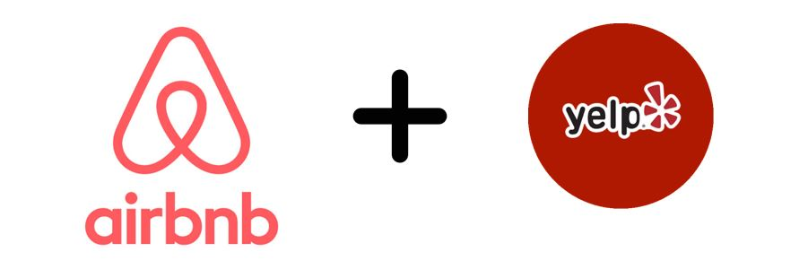

# Project 2: Shiny App Development Version 2.0

### [Project Description](doc/project2_desc.md)


## Airbnb Helper
https://jujuzyt.shinyapps.io/app_new/

Term: Fall 2019

Team : Section 1 Group 3

+ **Team Members**: 
	+ Xiwen Chen | xc2463@columbia.edu
	+ Daniel Weiss | dmw2180@columbia.edu
  + Nichole Yao | yy2860@columbia.edu
  + Justine Zhang | yz3420@columbia.edu
  + Jerry Zhang | jz2966@columbia.edu

+ **Project summary**: 


Currently, there exists an over abundance of information available to via social media and it can be tough to filter through all of it -- especially when planning a trip. Our app seeks to leverage data from popular apps such as Airbnb and Yelp in order to better plan out a vacation in NYC! This app is an Airbnb and Yelp listing search engine designed for first-time visitors to New York. It can help users make a wiser choice on Airbnb based on their preference for restaurants, facilities, and the trade-off between housing prices and ratings. It leverages Yelp restaurant data to help users find great places to eat near based on their preferences. In this project, we employed comprehensive datasets including Airbnb listing details, Airbnb reviews, Yelp restaurant ratings, and NYC facility information. Additionally, in order to gather Yelp restaurant data, utlized Yelp Fusion API in order to gather 5000+ of Manhattan's most trendy restaurants and create our own dataset.


On the 'Dining/Activities' map, users can filter through which area of Manhattan they are most interested in visiting. By setting custom preferences such as activities and cuisine choices. They can also filter through restaurant ratings and find the names and addresses of food options that best match their query. Additionally, they can visually determine areas on NYC that have the highest concentration of certain cuisines and activities via a heatmap. 


On the 'Airbnb' page, the first impression a tourist will get is the distribution of average Airbnb housing prices in different neighborhoods. The deeper the color, the higher the price. After setting the favorite neighborhood, price range, room type and the number of nights to stay, tourists can locate the housings which fit them the best. Besides, we allow users to set the minimum rating to further filter. They can also play with the trade-off between price and rating to optimize their choice. Once users find their favorite listings, they can click on the small circle on the map to view the housing details, including price, number of reviews and Airbnb URL. By clicking the Airbnb URL, they will go directly to the Airbnb website of this listing to contact the house owner. 


+ **Contribution statement**: ([default](doc/a_note_on_contributions.md))<br>
Data acquisition and manipulation: Everyone
UI Design: Everyone
Dining+Activities page: Daniel Weiss, Jerry Zhang
Airbnb page: Xiwen Chen, Nichole Yao, Justine Zhang
Contact page: Justine Zhang
Presentation: Justine Zhang


Following [suggestions](http://nicercode.github.io/blog/2013-04-05-projects/) by [RICH FITZJOHN](http://nicercode.github.io/about/#Team) (@richfitz). This folder is organized as follows.

```
proj/
├── app/
├── lib/
├── data/
├── doc/
└── output/
```

Please see each subfolder for a README file.
